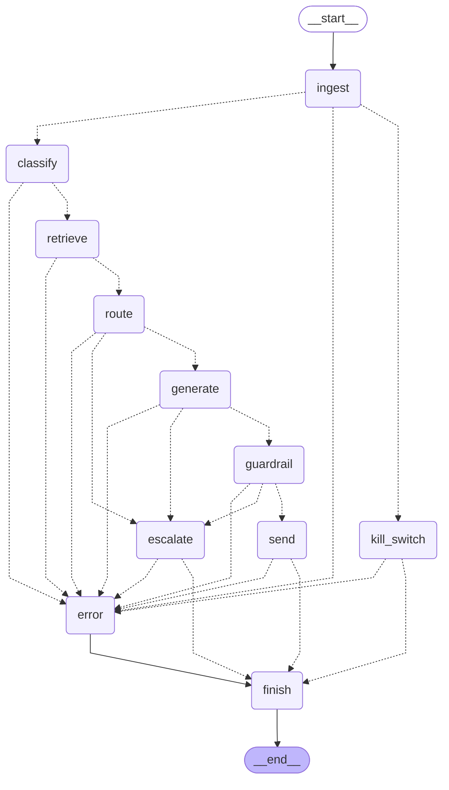

# Pipeline graph (LangGraph)

Generated by `python -m src.api graph`. Dotted arrows are conditional edges: each one is a routing decision made by a function in `SupportPipeline` (src/api.py).

```mermaid
---
config:
  flowchart:
    curve: linear
---
graph TD;
	__start__([<p>__start__</p>]):::first
	ingest(ingest)
	classify(classify)
	retrieve(retrieve)
	route(route)
	generate(generate)
	guardrail(guardrail)
	send(send)
	escalate(escalate)
	kill_switch(kill_switch)
	error(error)
	finish(finish)
	__end__([<p>__end__</p>]):::last
	__start__ --> ingest;
	classify -.-> error;
	classify -.-> retrieve;
	error --> finish;
	escalate -.-> error;
	escalate -.-> finish;
	generate -.-> error;
	generate -.-> escalate;
	generate -.-> guardrail;
	guardrail -.-> error;
	guardrail -.-> escalate;
	guardrail -.-> send;
	ingest -.-> classify;
	ingest -.-> error;
	ingest -.-> kill_switch;
	kill_switch -.-> error;
	kill_switch -.-> finish;
	retrieve -.-> error;
	retrieve -.-> route;
	route -.-> error;
	route -.-> escalate;
	route -.-> generate;
	send -.-> error;
	send -.-> finish;
	finish --> __end__;
	classDef default fill:#f2f0ff,line-height:1.2
	classDef first fill-opacity:0
	classDef last fill:#bfb6fc

```
